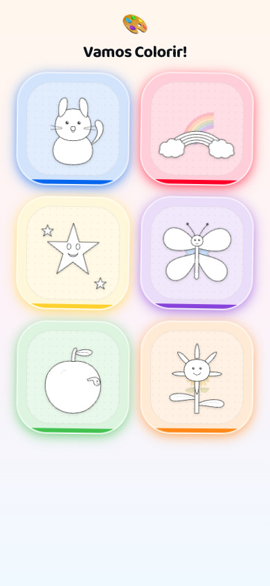

# Colorir Game

Um app simples de colorir, feito com carinho pra minha filha.

A ideia é ter um cantinho leve, sem propaganda e sem distração, onde ela pode escolher um desenho, pintar do jeito dela e voltar quando quiser. Se o seu filho ou filha também curtir, fico feliz que use — e mais feliz ainda se quiser contribuir com novos desenhos ou melhorias.



## Rodando localmente

Pré-requisitos: [Node.js](https://nodejs.org) 20+ e [pnpm](https://pnpm.io).

```bash
pnpm install
pnpm dev
```

O app abre em `http://localhost:5173/colorir-game/`.

Outros comandos úteis:

```bash
pnpm build     # build de produção
pnpm preview   # serve o build local
pnpm lint      # roda o ESLint
```

## Stack

- React 19 + TypeScript
- Vite + PWA (funciona offline depois da primeira visita)
- Tailwind CSS 4 + shadcn/ui + Radix
- React Router

## Contribuindo

Toda ajuda é bem-vinda, principalmente:

- **Novos desenhos** — SVGs simples, com áreas bem fechadas pra pintar. Dá uma olhada em `src/assets/svg/` e `src/data/drawings.ts` pra ver o padrão.
- **Melhorias de UX** pensando em criança pequena (botões grandes, feedback claro, pouca leitura).
- **Acessibilidade** e suporte a tablets/touch.

Pode abrir uma issue contando a ideia antes de mandar PR, ou já mandar direto se for algo pequeno. Sem cerimônia.

## Licença

Projeto pessoal, código aberto pra quem quiser usar e contribuir.
